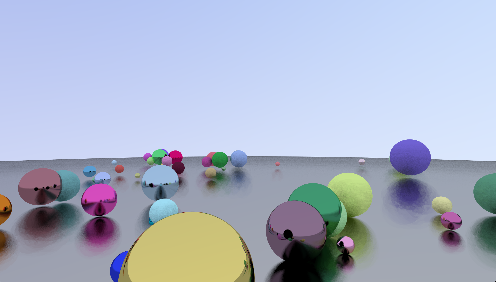

# OpenGL-Raytracing
Here's what it looks like

clone this repository, open it in vs code, use command shift B for "Run Build Task" to compile the code, and then in the command line type "./app" and hit enter to run the program.

used "raytracing in a weekend" 

you can edit the samples and reflection count in frag.glsl. Also, the render will automatically update if you drag the corner of the window to resize it.